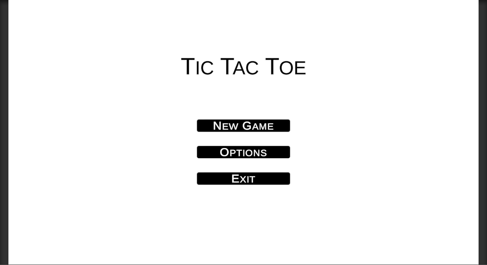

# Mini Games created in the Unity Game Engine
### Small and fun projects that appeal to my artistic and technical self

## Projects
### 1. 2D Tic Tac Toe
This is as simple and elegant as it gets. The classic game implemented with a new-age tool. Crisp black and white graphics and a simple design focused purely on the game

